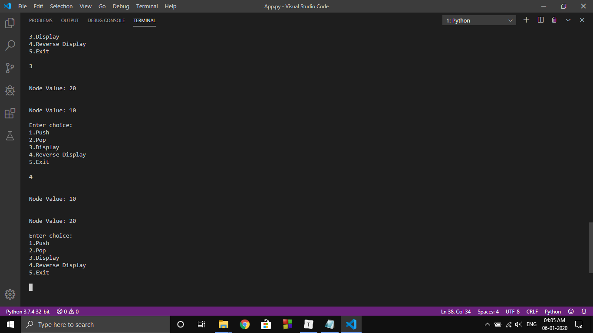

# Doubly Linked List in C Java Python
Doubly Linked List in C Java Python is an implementation of DLL using 3 different languages. This DLL is developed keeping in Stack functions. Other functions can also be implemented. More features will be added once I get time!

## Run it here:

[!repel.it](https://doubly-linked-list-in-c-java-python.iamsomraj.repl.run/)

## Image

## 

## Note

~~Date 06.01.2019:~~

~~There is an issue in C language. I am unable to set new head and also clear the head previous pointer. Therefore, during reverse display it is going to an infinite loop.~~

~~Newer Update:~~

~~I have fixed the error. But I just tweaked my reverse display so that it can work normally. Feel free to suggest any work around.~~

Fixed:

Thanks to [Rohan](https://github.com/RohanAlmighty) 😊 . He resolved the issue!

## Functions Implemented

1. **Push**
2. **Pop**
3. **Display**
4. **Reverse Display** ( only to verify the reverse pointer )

## Developer

LinkedIn : [iamsomraj](https://www.linkedin.com/in/iamsomraj/)

HackerRank: [iamsomraj](https://www.hackerrank.com/iamsomraj?hr_r=1) 

## Show Your Support

Give me a star if this project helped you

## Contributing

Pull requests are welcome. For major changes, please open an issue first to discuss what you would like to change.

Please make sure to update tests as appropriate.

## License

[MIT](https://choosealicense.com/licenses/mit/)
